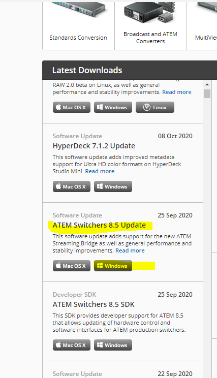
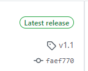
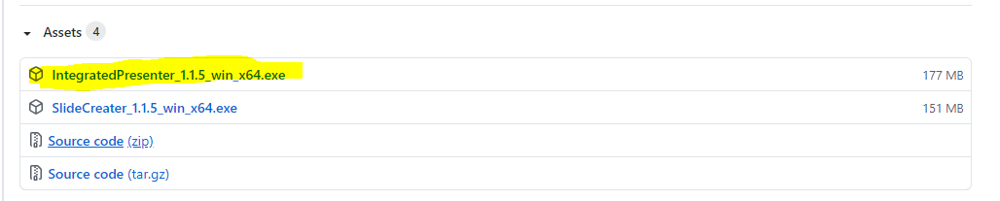
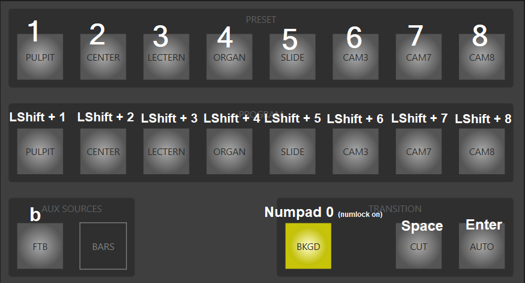
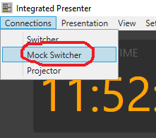
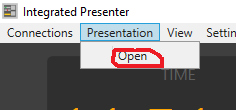
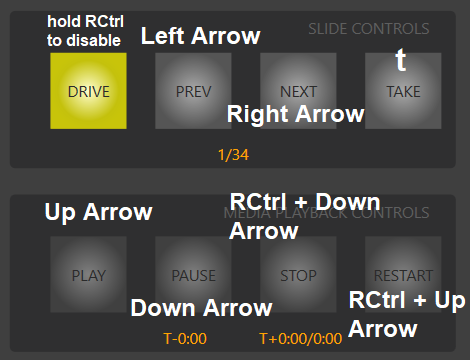

# Livestream Service Suite Documentation

In this issue we'll look into how to use integrated presenter.

# Integrated Presenter

Integrated Presenter is the software that is used to control the BMD Video Switcher https://www.blackmagicdesign.com/ca/products/atemtelevisionstudio
It is also responsible for displaying all the slides used in the service.

## Installation

Follow the steps below to install and run Integrated Presenter. It is possible (and encouraged) to run it at home and practice/learn how it works.

### Install Dependencies

1. Download and install ATEM Software Control. This is the program that is provided with the switcher. We need to install it since it registers the COM component that holds the API for the BMD Switcher (which is what is leveraged by Integrated Presenter allowing us to control the switcher).
You can find the download here: https://www.blackmagicdesign.com/ca/support/
Under Latest Downloads find ATEM Switchers 8.3 Update (this is what Integrated Presenter is built against, but newer versions should also work).

Download for windows and follow the prompts to install.

2. Download the latest version of Integrated Presenter. The latest version can be found here: https://github.com/kjgriffin/LivestreamServiceSuite/releases
Look for the Release tagged 'Latest release'

Under Assets download the Windows 10 x64 .exe for Integrated Presenter

After downloading Integrated Presenter you should be able to run it.

## Running Integrated Presenter at Home

Nominally Integrated Presenter is designed to control the BMD Switcher. Since most folks don't have one lying around, Integrated Presenter also offers a solution for those playing around at home. It will connect to a 'mock' switcher, and generate an approximation of the switcher's multiviewer output.

## Tour Integrated Presenter

When you run Integrated Presenter you should see the main control panel.

On the left half of the screen are the default controls.

### Timers / Clocks
At the top you'll see a 3 clocks. The leftmost is simply the current time.
In the middle is the shot timer. Every time you change camera shots this will reset. The time will change from orange to red after 2:30 to help you keep track of how long you've stayed on the current shot.
On the right is a general purpose time. It will keep counting up until you click it to reset. (It will also be reset automatically at the start of the sermon).

## Warning Light
Finally at the top is a the Master Caution Light. Gray means everything is working as intended.
Currently it is setup to turn red at the start of a service to warn you to start recording. Click the circle to reset.

## Program & Preset Bus
The next two rows of buttons are for controlling the video switcher.

Clicking a button on the Preset Row will change which camera is the currently selected preset.
Likewise clicking a button on the Program Row will change which camera is on air. (USE WITH CAUTION since this changes what is going on-air).

## Aux Sources

FTB will make the program (on-air) output fade-to-black.

The color bars source is currently not implemented.

## Transitions

The BKGD button selects the Background layer to be part of the transition. (This should normally be on. See the advanced PIP section to learn more about upstream keys and transitions)

The CUT transition performs a cut transition. The program output will immediately switch to what is on the preset.
The AUTO transition performs a dissolve transition. The program output will fade into what is on the preset.

## Keyboard Shortcuts

If you like the keyboard more than the mouse you're in luck. We've got a key for almost every button!

# Try it out

At this point you should be ready to try switching cameras and using transitions. To enable the controls and see what effect they have you can open the mock switcher.

1. Open the Connections menu at the top and click "Mock Switcher"

This should open a new window. This will approximate what you would see on the multiviewer output from the BMD switcher. (What is on the TV monitor at church)

Just like at church, the program output is in the top right, and the preview is in the top left.
Currently we have 4 cameras. The Pulpit cam (left), Center cam (left-mid), Lectern cam (right-mid), and Organ cam (right)

The bottom left will also display the presentation if one is open (view the Presentation section to learn how to generate and use a presentation).

Back on the main control panel you should see that all the switcher controls are now active and you should see their effect on the multiviewer.

Try clicking a button on the program or preset row. See what happens on the multiviewer.
Not try using cut and auto transitions.

Once you're familiar with selecting camera shots and transitioning between them we can start using a presentation.

## Doing it for real:

If you're at church/have access to a real hardware ATEM switcher click Connect Switcher. This will open a dialog asking for the switcher's IP address. The default address should be correct for church. Click OK. After a few seconds a message box should appear to let you know a successful connection to the switcher was made.

*Heads up, upon successful connection to the switcher, Integrated presenter will apply some configuration to the switcher (which will move all the cameras to correct position on the multiviewer, change the button labels on the control panel to match the camera setup and also configure the necessary keys on the switcher to support liturgy and picture in picture).
For more info about setting and configuration stay tuned for the advanced Integrated Presenter Tutorial.

# Presentations

During the service all the anthem videos/slides/liturgy/hymns are displayed using Integrated Presenter.
Currently the slides are generated using Slide Creator (stay tuned for the Slide Creator tutorial to learn how that works).
If you just want to get started you can find an old service presentation here: https://drive.google.com/file/d/19kj-S4SazRv2pv5IcQsHRiiNEaFFPXqn/view?usp=sharing
download the .zip and extract.

To run a presentation in Integrated Presenter open the Presentation Menu and click Open.

This should open an 'open file dialog'. Navigate to where you extracted the presentation you downloaded.
Click a file in the presentation folder, and click Open.

Integrated Presenter should now have opened a presentation. You will see the first 2 slides on the right hand of the main control panel.

The slide in red is what is being fed into the switcher. In green is the next slide in the presentation.
The top right shows the previous slide and the bottom right shows the 'after' slide. (the slide after the next slide ie 2 slides ahead)

If you have a multiviewer connected it will now show the slides in the bottom-left camera source.

Integrated Presenter will also open a new window that displays the slides. (This is what is used at church. The switcher connects to the streaming computer like a monitor, so we put this window on that monitor and press 'f' to make it full screen. 'ESC' to exit fullscreen).

## Presentation Controls

Now that we have a presentation open the presentation controls will be activated.

### There are 4 main slide controls.

1. Drive. When active this enables 'slide drive video' mode. This means that changing to the next slide may change what appears on the program output (instead of just changing what is fed into the slideshow source to the switcher).
This should normally be kept on for regular service use unless you know that you want to advance a slide without having any automation (more on that later).
2. Prev. Goes back a slide.
3. Next. Goes to the next slide. If drive is engaged it will also do the 'sensible' thing on the switcher. See the automation section for more details.
4. Take. If drive is engaged will do the 'sensible' thing, but instead of switching to the next slide, will just do any automation steps for the current slide.

There is also a counter to tell which slide you are on and how many slides in total the presentation is.

### Keyboard Shortcuts

We've got shortcuts for these too!

### There are also 4 Media Playback controls.

These remain inactive unless the current slide is a video file.

1. Play. Plays the video from the current position.
2. Pause. Pauses the video. Play will resume from here (unless you switch slides, then the video position is reset to the start)
3. Stop. Stops video playback. Resets the position to the beginning.
4. Restart. Will stop, reset the position to the beginning and begin playing again.

Below the controls are the 3 timers for the video.

T-0:00      -> Time remaining on the video
T+0:00/0:00 -> Current Position/ Total time

*Note that video files won't play on the mock switcher. For now you'll just see a still image saying 'video'.

## Presentations and Automation: What is "DRIVE" mode

Now that we've got a presentation opened we can get into the real reason Integrated Presenter was written. It automates some of the tedious and time sensitive steps for doing liturgy.

### How Liturgy works:

Liturgy is put on screen using something called a 'downstream key'. At a glance what is happening is we've configure one of the ATEM switcher's 2 available downstream keyers to cut the bottom 20% of whatever is fed into the 'slideshow' camera source and dump it on top of the program output. (Stay tuned for a more technical explanation in future tutorials)

To manually control the downstream keyer used for liturgy you can use the LITURGY controls on the control panel.

Pressing the 'LITURGY' button will toggle the keyer state. If the keyer is on whatever the 'slideshow' camera source will be put on top of the program output.

Pressing 'AUTO' will toggle the keyer state, but do so with a fade-in/fade-out.

Downstream keys are normally applied after (hence downstream) the transitions. Thus cut/auto transitions wont effect whether the downstream key is shown.

If you want to include toggling the downstream key state as part of the next transition the 'TIE' button will allow you to do this.

The best way to get a sense of what this means is just to try it for yourself. See what happens on the mock multiviewer.

### Manually doing liturgy

To better explain what drive mode does we'll go through the steps to do it manually.

Suppose we have a shot from the center cam on the program output and we want to display liturgy.
What we need to do is first go to the next slide in the presentation to get the correct slide. Then we would perform and auto fade in of the liturgy key. Now suppose the next slide is a full slide hymn. We'd have to first turn off the liturgy key, switch to the next slide, make sure the slideshow cam is on the preset source, and then call for a transition to get it display on the program output. That's a bunch of steps, so drive mode will automate it for you.

### How 'DRIVE' mode works

Presentation have 3 different slide types.

1. Full slides. These slides are fullscreen images (title pages, hymns etc.)
2. Liturgy slides. These slides have the bottom 20% to be keyed on.
3. Video slides. These slides are videos.

The following rules govern how drive mode works based on the current program source and the next slide type:

|Current program source | Next Slide Type | Actions |
|-|-|-|
| Camera (not slideshow) | Full | turn off downstream key -> next slide -> put slideshow cam to preset -> auto transition |
| | Liturgy | next slide -> fade in downstream key |
| | Video | turn off downstream key -> next slide -> put slideshow on preset -> auto transition -> play video |
| Full Slide/Video Slide | Full | next slide |
| | Video | Next slide |
| | Liturgy | auto transition (assumes preset is ok source) -> next slide -> fade on downstream key |
| Liturgy Slide | Full | turn off downstream key -> next slide -> put slideshow on preset -> auto transition |
| | Video | turn off downstream key -> next slide -> put slideshow on preset -> auto transition |
| | Liturgy | next slide |

Thus the point of drive mode is to simplify the number of button/steps to worry about.

At this point you should be ready to run through the provided service. Have fun and see how stuff works.

