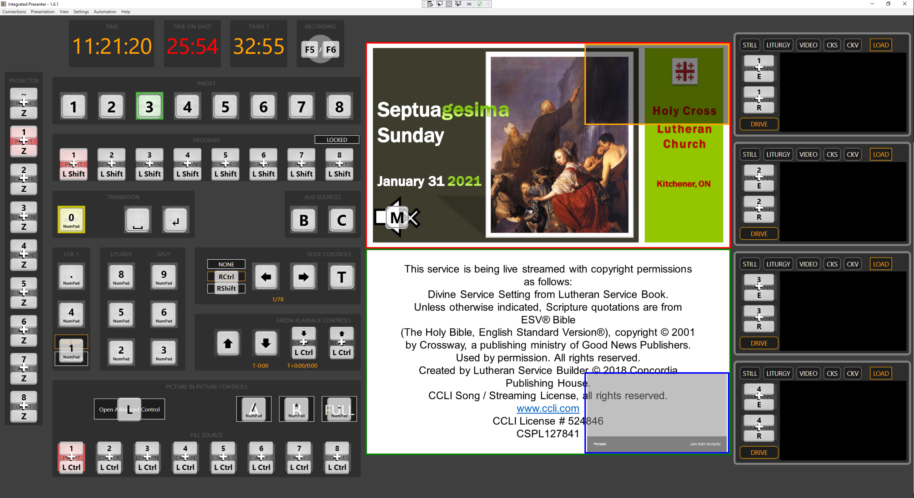
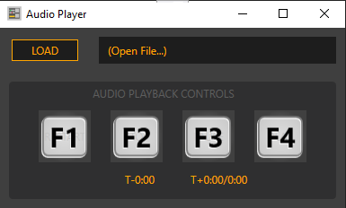
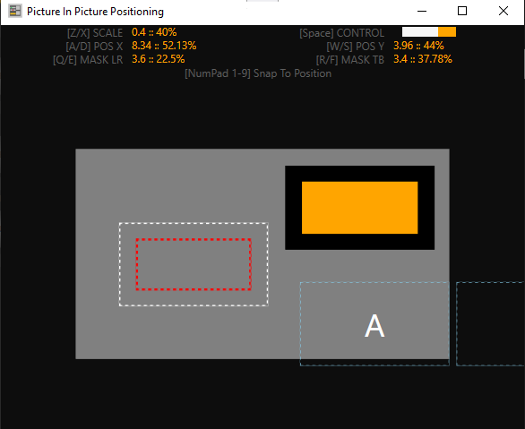

# Integrated Presenter Shortcuts & QuickStart

Shortcuts can be viewed via the **Help menu**, or with the **hotkey S**

## Main Window

** NOTES **
- Opening PIP Location Control will switch focus to PIP Location Controls
- Opening Audio Player will keep Main Window focused
- If Main Window has focus but Audio Player is opened:
    - F1, F2, F3, F4 will control audio player (play, pause, stop, restart)

### View Advanced Control Groups

### Main Window Controls

------

## Audio Player

** NOTE **

Pressing **hotkey [ESC]** will switch focus back to Main Window

------

## PIP Location

** NOTE ** 

Pressing **hotkey [ESC]** will switch focus back to Main Window

### Explanation

- The Gray Rectangle represents the entire display region.
- The Orange Rectangle shows a preview of where the unmasked portion of the DVE will be.
- The Outer Black Rectangle around the Orange Rectangle shows the entire (masked/unmasked) DVE.
- The Red/White Rectangles show the current position of the DVE
- The Blue Rectangles show the positions of Keyframes A and B 

### Controls

#### Move DVE

**W, A, S, D** move the DVE up, left, down, right respectively

#### Snapping

On the **NumPad 1-9** will snap the visible portion of the DVE to edges/corner/center

#### Masking

**Q, E, R, F** increase/decrease the Left&Right and Top&Bottom masks respectively

#### Send Commands

You can adjust and preview the placement of the DVE with the above commands. To update the position of the DVE on the switcher if commands are required to move the DVE to the desired location the **CONTROL** light will light orange.
Pressing **SPACE** will send the necessary commands to the switcher to move the DVE. 

-----

## Display Window

** NOTE **

- Pressing **hotkey F** will snap the window to a borderless full screen.
- Pressing **hotkey [ESC]** will return the display to a bordered window.

