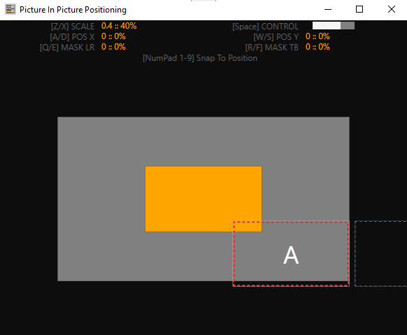

# Integrated Presenter Shortcuts & QuickStart

## Main Window

** NOTES **
- Opening PIP Location Control will switch focus to PIP Location Controls
- Opening Audio Player will keep Main Window focused
- If Main Window has focus but Audio Player is opened:
    - F1, F2, F3, F4 will control audio player (play, pause, stop, restart)

### Controls

### View Advanced Control Groups

## Audio Player

## PIP Location

## Display Window

