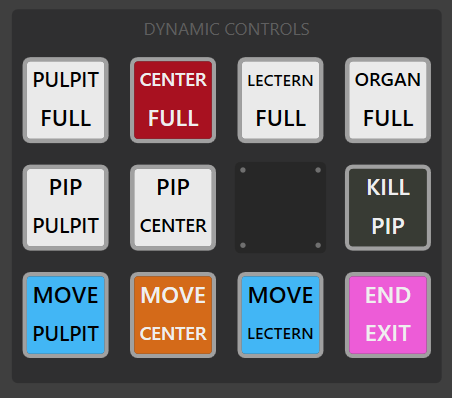

# Livestream Service Suite 1.10.1

Building off the work in 1.10

## Feature Highlights:

1. Support for NIV scriptures
2. Improved *standard* anthems in LSB servicification
3. Speedier Hymn Teardown

## NIV Scriptures

By popular demand (and necessity) the LSB importer comes with the option to override the scripture text with alternate versions.

New import options

- option to override with ESV (offline version)
- option to override with NIV (offline version)

NOTE:

- ESV takes precedence from NIV if both selected
- requires complex readings to work

This feature depends on the reading references being included from LSB. If they're not present, it will fallback to using the provided text.
If imported using NIV version, the CopyTitle slide will be automatically updated to include the appropriate copyright info.

New tool

Select from (currently) `NIV` or `ESV` versions
Enter reference in the following form:

- 1 John 3:12
- Matthew 5:2-10
- Genesis 3:2-5:6
- Exodus 22:14, 18-28

## Better Anthems

Drawing upon the new Dynamic Buttons feature, LSB imports are now updated with the following feature:

This has been designed for the *typical* anthem which is of either of the following forms:

- Choir + piano
- Soloist + choir

And nestled between the readings

Assumes to use a wide Center camera shot to start, and then loads in the panel.
Panel provides buttons to move pulpit/center/lectern cams to an anthem position.
Has options for selecting any camera in 'full' mode, or pulpit/center with the lectern in PIP.
Includes an emergency PIP off button.
Has an `EXIT` button that returns the lectern cam to the reading position, and removes the PIP/graphics in a safe manner via the pulpit camera

Notes:
- now takes advantage of the new `#html` layouts

## Speedier Hymn Teardown

Pressing Next twice (in a row!) getting to be too much? Consider using the following import option:

**RunPIPHynsLikeAProWithoutStutters** is the feature for you!
This will adjust the teardown script, such that taking 'next' slide will (in a single dissolve transition) remove the PIP and swap cameras, and then perform the following slide.

This works well in the case of Hymn->Liturgy, which is typically the case.
This feature does, however, depend on having Postset enabled. If postset isn't enabled, the feature has a backup to always force the center camera as the live source when exiting from the hymn. This *should* probably be fine in nearly every case.

Communion hymns are excluded from this by default.
Since there's delicacy involved in not broadcasting communicants, having the software automatically drive into things without the ability to stop may not be wise. Use the provided flag only if you really mean to.

[2023-08-19 Kris Griffin]
I personally find that having a separate teardown slide available to quickly remove the PIP useful during communion.
I'll also note that this feature has yet to be extended to creeds...

## Other Improvements

- SC: fix trusty save on close not writing entire .zip
- SC: tweak import logic to fuzzy detect date/title of service
- SC: adjust parsing `#html` `{}` braces to allow multiline
- SC: add/default enable Mk2 CopyTitle + new 75th anniversary image 

## Other Notes

- SC: There may or may not exist a potential for deadlock within the chrome-renderer

If your project is taking longer than 20sec to render, you can probably assume it's stalled.
The good news is an autosave was made immediately prior to the render, so simply exiting SC and then making use of the handy

button will get you right back to where you were, with no loss of work!
This should hopefully be tracked down and solved soon.

