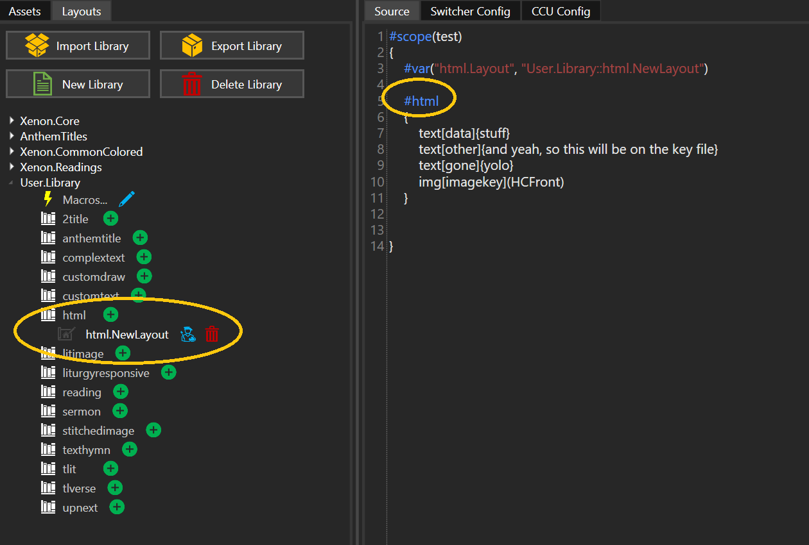
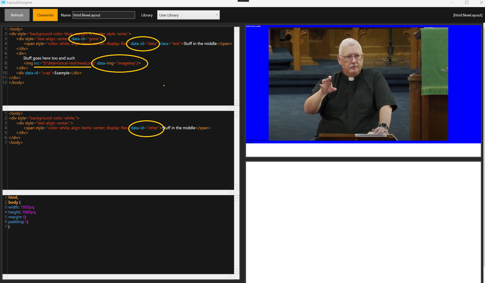
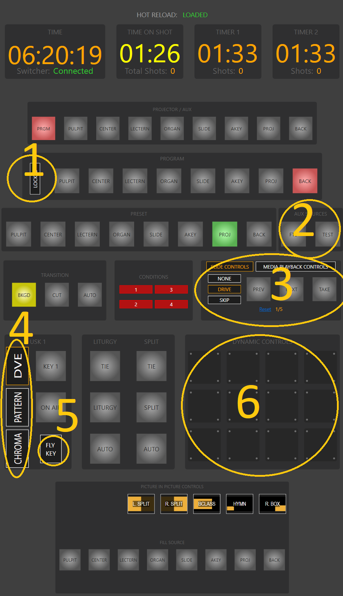
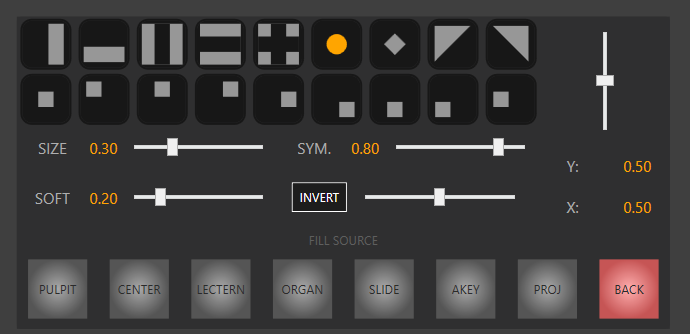
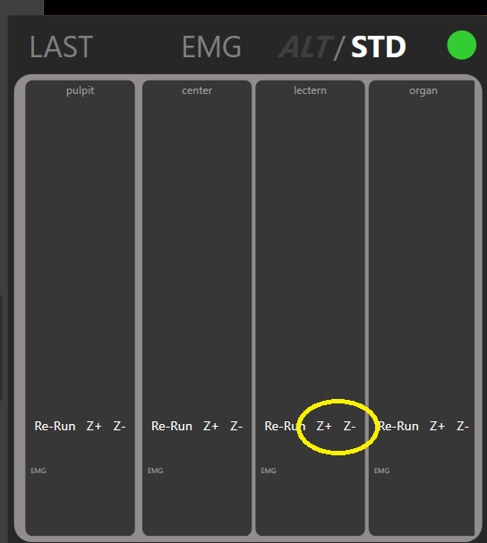

# Livestream Service Suite 1.10

## Feature Overview:

1. Slide Creater - Capability for HTML layouts
2. Integrated Presenter - Dynamic Controls
3. Integrated Presenter - Pattern Keying
4. Integrated Presenter - Camera Driver improvements

## HTML Layouts

If editing cumbersome JSON files and attempting to figure out which textbox is which (while wondering why you can't also draw some other primitive) has been eating away at you- look no further than using the newly supported `#html` command. Offering a modern, and sensible method for defining layouts, the `#html` command may be for you.

Layout is editable via the LayoutDesigner as usual (but better...)

Command accepts layout overrides as usual.
*NOTE: Xenon.Core's default layout is just a white page.

using the `text` command, any valid html content (enclosed in the `{}`) can be injected to the slide at render time
using the `img` command, any image that's a project asset (named in `()`) can be injected to the slide at render time

Both commands will look for (but not required to find) a matching `data-id` or `data-img` attribute on the defined layout.
The `data-img` attribute is further restricted to reside on a `` tag. (no no restriction for `data-id`)

Setting `data-img` will cause the render to substitute the `` `source` with the appropriate value to target the project asset. (NOTE: the layout (via the designer), could technically have a absolute path to a img on disk... but this is probably a bad idea since not all computers everywhere will have access to it. But for testing...)

Setting the `data-id` will have the renderer replace that tag's inner html with the supplied content. Nest at your own risk!
Though this means you can define HTML in the Xenon Source code and insert it there if you like. (but `{}` and `//` and `/* */` will not be escaped, so that *may* put a limit on what can be done)

* designer's hot-reload has been modified. After 1 second of no change it should auto-refresh. Failing that the Refresh button will still be purple. Press manually (or CTRL+R)

First things first: the 'html' style layout is still (under the hood) a json file. The designer is being helpful and detects the layout is really meant to be interpreted as HTML.
It provides an HTML editor for the Display image, and an HTML editor for the Key image. The bottom editor is for the **Shared** CSS file.

How this all works:

1. The layout is loaded. The slide command inserts/modifies the layout's html according the what you've written. The shared css file is inserted to the html file. This (complete) file is then saved to disk as a tmp file. A headless chrome instance is used to render the image, where a screenshot is taken. The same process applies, but to the HTML key layout.
2. The key image is unmodified. The 'main' image is further 'pre-multiplied' (as usual for all slides) against the generated key image. (NOTE: it appears html doesn't really let you define a fully transparent document, so the preview editor may show a default white background)
3. It's my understanding that CHROME is required to be installed on any system attempting to use this.
(I also ran into an issue once where CHROME had auto-updated on my computer, and that required me rebuild Slide-Creater with a updated selenium driver package... this may bite us again at some point)
4. Chrome is allowed its whims, so layouts may not be truly reproducible for all eternity as our overlords release updates.
(e.g. how it handles font's doesn't appear to match with windows i.e. Arial Narrow in chrome doesn't look the same)
5. I **think** we can force repeatable image sizes through various manners, and it looks like (our default for now of 1920x1080) will work.
    - Chrome is started with the following arguments:
    --window-size=1920x1080
    --hide-scrollbars
    --no--sandbox
    --headless

6. To enable acceptable performance, only 1 chrome instance is used. All slides (and layout designers) will serially access the same instance in sequence to render their images. Even when parallel rendering is enabled (default). I don't think this will be a significant performance impact compared to the CPU bound work of the ImageSharp library drawing primitives from other slides.

This new layout *should* be able to generate an equivalent to the following commands (which only provide a modest combination of textboxes, shapes and images)

- customtext
- customdraw
- anthemtitle
- 2title
- reading
- sermon
- litimage
- upnext
  
NOTE: to truly replicate the `#sermon` command you'd need to set the following on the HTML main layout

`<meta data-slide-type="Liturgy-t1restart"/>` Since the sermon slide will restart the general purpose timer 1

Setting a meta attribute of `data-slide-type` allows the html layout in the same manner as the JSON layout's `SlideType` (i.e. "Liturgy", "Full", "Action" etc.)

Layouts that use 'liturgy style' text-boxes (complextext, tlverse, liturgyresponsive) *could* possibly be rendered through clever use of a html layout, but the major benefit of those commands is the line-breaking algorithm (for which any html layout engine will not do).

## Dynamic Controls

- Updated UI controls in Integrated Presenter

1. Adjusted position of 'lock' for program bus
2. Moved Test pattern source/fade to black to 'program row' (hopefully this isn't confusing)
3. Media Playback controls now a tab page with the slide controls
   - We don't use a lot of videos and we needed the screen space
   - Keyboard Shortcuts for media playback are still available at all times (F1-F4)
   - Media timers less critical since slide previews now (and have for a while) show countdown timers
   - Not anticipated to need to be manipulating media and slides at the same time. (since media IS the slide)
   - If you really need a clickable button, have the slide load a dynamic controller with the buttons you want
4. Rearranged USK1 key types. Added new option to configure for PATTERN
    - like before, advanced PIP controls are contextual and reflect the selected keyer mode
5. Rearranged what was the old 'Advanced PIP controls'
    - the more correctly named 'fly keyer' is responsible for scaling and repositioning the DVE (which Integrated Presenter exclusively ties to USK1).
    - since PATTERN keying supports using the fly-keyer, you can use the same controls to arrange the pattern (see PATTERN KEYING for details)
6. Newly found screen space allows for a 4x3 matrix of run-time configurable buttons.

### DYNAMIC CONTROLS
The new 4x3 matrix can host user defined buttons. *Panels* are loaded from a file defining them.
Operators can manually load a panel at any point through the menu>Interaction>Load Dynamic Buttons

Slides scripting API updated to include capability to load Panels. i.e. a script slide can load a panel.

The panel defines various buttons. Each button when clicked can execute a script. (yes... this means you can load a panel, where buttons on that panel load other panels allowing for paging).
Buttons also support updating their visual style according to any available watch variables. (i.e. they can light up based on the state of the switcher/presentation/user conditions)

* buttons can't currently control the camera driver, but work is in progress to enable that in a manner that makes sense
* buttons have no keyboard shortcuts. This may change
* buttons are currently buttons. More controls may be supported in future
* Controller is limited to a 4x3 matrix. More controllers may be supported in future

* script API to load controller expects the controller to live in the presentation folder

* when in hot-reload mode (unlike camera EMG presets), the reloader will not calculate (and load) which panel should be loaded (in the event previous slides would have loaded a panel)
    - i.e. if using hot-reload to check if a panel works, you'll need to re-run the slide that loads the panel

Slide Creater support

- new command to generate a panel and render it as a resource to the presentation

Example of simple panel:

    #dynamiccontroller(bibleclass_panel1)
    {
        dynamic:matrix(4x3);

        [Globals]
        {
            cmd:WatchSwitcherStateBoolVal(USK1OnAir, true, usk1on);
            cmd:WatchSwitcherStateBoolVal(DSK1OnAir, true, dsk1on);
            cmd:WatchSwitcherStateIntVal(ProgramID, 8, pulpitOnAir);
            cmd:WatchSwitcherStateIntVal(ProgramID, 7, centerOnAir);
            cmd:WatchSwitcherStateIntVal(ProgramID, 6, lecternOnAir);
            cmd:WatchSwitcherStateIntVal(ProgramID, 5, organOnAir);
            cmd:WatchSwitcherStateIntVal(ProgramID, 4, slideOnAir);
            cmd:WatchSwitcherStateIntVal(ProgramID, 2, projOnAir);
            cmd:WatchSwitcherStateIntVal(AuxID, 2, projOnAux);
            cmd:WatchSwitcherStateIntVal(AuxID, 0, blackOnAux);
        }

        [TButton]0,1
        {
            draw={
                TopText=PIP;
                BottomText=PULPIT;
                Enabled=true;
                <pulpitOnAir*usk1on>BackColor=#a81120;
                <!pulpitOnAir+!usk1on>BackColor=#eaeaea;
                <pulpitOnAir*usk1on>TextColor=#efefef;
                <!pulpitOnAir+!usk1on>TextColor=#000000;
            }
            fire={
                cmd:JumpToSlide(%slide.num.overlay.0%);
                cmd:PresetSelect(8);
                cmd:USK1Fill(2)[PIP fill Proj];
                cmd:PlacePIP(-4.8,0,0.7,0.7,0,0,0,0)[Place PIP];
                cmd:DelayMs(100);
                <dsk1on>cmd:DSK1TieOff;
                <!dsk1on>cmd:DSK1TieOn;
                cmd:DelayMs(100);
                <usk1on>cmd:USK1TieOff;
                <!usk1on>cmd:USK1TieOn;
                cmd:DelayMs(100);
                cmd:AutoTrans;
            }
        }
    }

`#dynamiccontroller` is the command to generate a controller file. `(<name>)` is the name of the controller file that will be generated. Can be used by the following command in a script:
`cmd:SetupButtons(bibleclass_panel1, %pres%, true);`
This command will load a new controller as defined in the file `bibleclass_panel1` it will look in the folder of the presentation and will overwrite all buttons locations (even if the controller doesn't explicitly define a button for every matrix location, installing a empty button in that case)
* Note: you could instead of using the special variable `%pres%` choose to list a absolute path to a controller file... but this would require that file exist there.

`dynamic:matrix(4x3);` specifies the type of controller. As of now, this is the only valid controller, but in future more may be available.

The rest of the contents are optional.

`[Global]{<contents>}` is intended to provide a mechanism to specify watches the controller should setup. It will happily accept any valid script, but the script contents will only be evaluated to extract watches. These will be tracked and provided to the controller.

`[TButton]<position>{}` allows the definition of a text-button (currently the only supported button type). `<position>` should specify the X,Y location on the matrix to install the button. Multiple definitions for the same location will overwrite the previous definition.

`draw={}` defines how the button should be displayed.
Buttons can display 2 lines of text (top/bottom), can have a background color and text color and can be enabled or disabled.
Draw commands accept 'conditionals' in the same manner of scripts. Any watched condition can be used to selectively run the various draw commands. Buttons are re-drawn every time any watched condition is changed.

`fire={}` defines a script that will be run when the button is clicked (button must be enabled to be clickable).
Anything that can be run as a slide script will work here.

### Jump To Slide

Scripts can perform a jump to slide.
*NOTE: automation is enabled on the target slide. Meaning the effect is equivalent to using 'skip' mode to set the 'next slide' to the target, and then performing a nominal 'take next slide' in drive mode.
* this presents an issue for the case where you want to jump to a slide, but NOT have any automation applied. In this case the solution is to wrap the target slide in a `#scripted` block with an empty script.

Because some commands generate an un-bounded number of slides, and because it seems like the sort of thing a computer program ought be able to do- manually calculating the slide number of your jump target is NOT required.

Any valid `#<command>` can be tagged with a label `[@label::<label-name>]`. This will add metadata to every slide that is generated from the command so that they can be referenced as jump targets.
`%slide.num.<label-name>.<index>` will be evaluated at compile time. the `index` is relative to the `label-name`.
E.g. if you label a hymn command 'hymn-example' that generates 4 slides, then '%slide.num.hymn-example.0' will be evaluated as the slide number of the first hymn slide, etc. You can also use negative indexing to refer to the last slide generated by the command like so: '%slide.num.hymn-example.-1'.

### Conditional Expressions & Watches
To setup a watch best practice is to use the general purpose watch command:
`cmd:WatchState<TYPE>Val(ProgramID, 6, lecternOnAir);`
* NOTE: using `WatchSwitcherState` style commands do the same thing, but technically you can watch more than just the switcher state now... and its less characters to type.
* You'll need to know the underlying type of the variable you're watching, because you can't use an `int` watch on a `boolean` variable.
* The first argument is the name of the exposed variable, the second is the value it will be compared against for equality. All conditionals are evaluated to either be true/false. Final argument is the name of the watch and can be referenced by any conditional expression.
  
Integrated Presenter will evaluate any boolean expression. Conditional expressions are required to be written in sum-of-product form. `+` indicates boolean summation and `*` (and for legacy reasons `,`) indicates a boolean product. `!` can be used for boolean negation. Order of operations is observed.

## Pattern Keying

Exposed most of the underlying ATEM API for pattern keying.
Note: unlike ATEM Software Control, I've made the executive decision to implicitly enable the Fly-Keyer at all times for PATTERN-KEYING. Setting the fly-keyer to scale of 100% with no X/Y offset produces the same graphical result as having it disabled, but makes tracking the state far easier. This also gives the benefit of maintaining the fly-key position when switching between DVE mode and PATTERN mode.

Pattern controls match mostly what ATEM Software control provides. ATEM TV Studio HD has 18 patterns.

* NOTE: Integrated Presenter's sliders are not *super* responsive. This is intentional. Expected use case is use the UI to 'guess' to develop a layout off-air, and then use a script to setup the PATTERN keyer (much like our current approach for hymn slides).

Implemented script API for pattern keying.

* NOTE: mock multiviewer target does NOT support any graphical display of what the PATTERN keyer is doing. It's unclear how/if this will be possible to do with WPF. Some of the effects may not be possible to get accurate enough to be graphically useful.
  
## Camera Driver Improvements

- stubbed in the plumbing for an organ camera mount

- updated UI with **MORE** color to mark camera states (ready=blue, running=light-green, done=dark-green, failed=red)

Adjusted the camera driver code in an attempt to coax the tightest timing tolerances from Windows underlying socket API.
- not sure if anything was really gained here
- initial tests suggest we *may* be able to repeatably meet 100ms timing intervals

[2023-08-19] UPDATE:
Through analysis of the driver logs (which now log timing details), it is apparent that reliable low-latency is not possible for round-trip communications. I've thus elected to relax the timing bounds, and allow for around ~100-150ms slop.
The critical timing is Computer->Camera NOT Computer->Camera->Computer. We'll instead *trust* the cameras to be fast, and if they respond within a *reasonable* time, treat it as though they were accurate.
  
Groundwork for better preset management
- building in DEBUG will enable initial implementation for 'zoom bumping'
  
- idea to allow for run-time adjustment of a preset
- for now will Z+/Z- by 100ms
- initial tests suggest this is both reasonably repeatable but unclear if we can do anything useful with it just yet, or achieve a usable zoom increment

